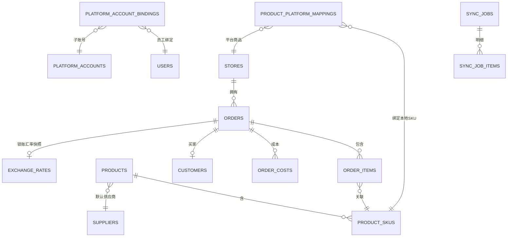

# Ali-Sync 跨境电商智能 ERP · 技术设计文档

> 版本：v2.0（对齐 PRD V3.5 + 最终技术栈）　|　定位：阿里巴巴国际站优先、1688 后续扩展
> 开发方式：**全部由 AI 辅助开发**　|　部署：云服务器（宝塔 + Docker Compose）

---

## 1. 技术栈（最终版）

| 层 | 选型 | 说明 |
|----|------|------|
| 前端 | **Vue 3 + TypeScript + Vite + Element Plus + Pinia** | 手写轻量后台布局，不用 vben-admin |
| 后端 | **NestJS (Node 20) + Prisma** | 全栈 TS，Prisma 单文件管全库类型 |
| 数据库 | **PostgreSQL 16** | JSONB 存平台快照 |
| 缓存/队列 | **Redis 7 + BullMQ** | 定时同步、异步导出、失败重试 |
| 认证 | **JWT（手写）+ RBAC** | 按钮级权限 + 店铺级数据隔离 |
| 导出 | **ExcelJS / pdf / docx** | 服务端生成，异步队列 |
| 打印 | @worm-vue3-print/core + print-render 微服务 | 按 PRD，三端一致 |
| 云存储 | 阿里云 OSS | 素材中心 |
| 部署 | 宝塔 + Docker Compose | nginx + api + worker + postgres + redis |

### 1.1 为什么这套最适合"全 AI 开发"
1. **单语言**：前后端都是 TypeScript，AI 上下文不切换、出错率低。
2. **声明式 schema**：数据库改一个 `schema.prisma` 文件，类型自动同步。
3. **零重脚手架**：页面就是普通 `.vue` 文件，AI 指哪改哪、坏了好查。
4. **可验证**：TS 类型检查 + 单测能立刻抓住 AI 的错误。

---

## 2. 已确认业务规则（含最新 3 条）

| 编号 | 规则 | 实现要点 |
|------|------|---------|
| R1 | 金额精度保留 **2 位** | 金额 `NUMERIC(18,2)` |
| R2 | 汇率保留 **6 位** | 汇率 `NUMERIC(18,6)`，保证利润换算精度 |
| R3 | 库存双轨 | 本地库存 + 平台同步库存都存；**订单扣减本地库存**，同步库存仅参考 |
| R4 | 成本自动取本地产品价 | 订单商品绑定本地产品 → 采购成本 = 本地产品成本价（可改） |
| R5 | 汇率锁账快照 | 订单 LOCKED 时快照下单时间对应内部汇率，锁账后成本/汇率不可变 |
| R6 | 三类成本 | 采购 / 运输 / 其他，可 [+] 多条动态成本自动求和 |
| R7 | 店铺级数据隔离 | 业务员经"平台子账号绑定"只看自己店铺，老板看全部 |
| R8 | 首期只做国际站 | 1688 适配留 `platform` 字段扩展 |

---

## 3. 系统架构

```
┌───────────────────────────────────────────────────────────┐
│                  前端 Vue3 + Element Plus                     │
│   登录 / 店铺 / 商品 / 订单 / 成本 / 利润 / 导出 / 报表 / 系统   │
└──────────────────────────┬────────────────────────────────┘
                           │ HTTPS (JWT + RBAC)
┌──────────────────────────▼────────────────────────────────┐
│                    Nginx (反向代理/静态资源)                 │
└──────────────────────────┬────────────────────────────────┘
                           │
┌──────────────────────────▼────────────────────────────────┐
│                 NestJS 应用（模块化）                         │
│  auth · users · roles · stores · alibaba · orders ·        │
│  products · costs · suppliers · materials · ai · reports · │
│  exports · sync · audit · notify                            │
│  AuthGuard → PermissionsGuard → DTO 校验 → Service → Prisma │
└──────────┬───────────────────────────────┬────────────────┘
           │                               │
     ┌─────▼─────┐                  ┌──────▼──────┐
     │ PostgreSQL │                  │ Redis(BullMQ)│
     │  (53 张表)  │                  │ 定时/队列/重试 │
     └───────────┘                  └──────┬──────┘
                                           │ 出站 HTTPS
                                    ┌──────▼──────┐
                                    │ 阿里国际站开放平台 │
                                    │ (OAuth + API)   │
                                    └─────────────────┘
```

### 3.1 后端模块（NestJS 目录）

```
src/modules/
├── auth/         # 登录、JWT、守卫
├── users/        # 用户
├── roles/        # 角色/权限/菜单 (RBAC)
├── stores/       # 店铺 + OAuth + 子账号绑定
├── alibaba/      # 阿里国际站对接层（AlibabaPlatformAdapter）
├── orders/       # 订单 + 成本 + 利润 + 锁账
├── products/     # 商品 + SKU + 双轨库存 + 平台映射
├── suppliers/    # 供应商
├── materials/    # 素材 + OSS
├── ai/           # AI 审查网关
├── reports/      # 报表
├── exports/      # 导出队列
├── sync/         # 同步引擎（定时 + 队列）
├── audit/        # 审计日志
└── notify/       # 告警通知
```

---

## 4. 核心模块设计

### 4.1 店铺与 OAuth（国际站）
- 添加店铺 → 选平台 → 跳官方授权页 → 回调换 `access_token`/`refresh_token` → AES-256-GCM 加密入库。
- `state` 防 CSRF（Redis，600s）；token 到期前自动刷新，失败标记 `REFRESH_FAILED` 并告警。
- 同步平台子账号 → `platform_account_bindings` 绑定 ERP 员工，作为数据隔离依据。

### 4.2 订单同步引擎（增量 + 幂等）
```
1. 读店铺上次同步游标（modified_date 修改时间，美国时间转 UTC）
2. 调 alibaba.seller.order.list（role=seller, page_size=100, start_page=0）
3. 以 (store_id, platform_order_id=trade_id) UPSERT（唯一键幂等）
4. 更新游标 + 写 sync_jobs / sync_job_items（单条级失败可重试）
5. 失败经 BullMQ 重试，超限告警
```
- 触发：定时（5/15/30/60 分钟可配）+ 手动"立即同步" + 按时间段补拉。
- 平台返回原始 JSON 存 `orders.platform_raw`；平台原始状态存 `orders.platform_status`，ERP 业务流转状态存 `order_status`。
- 接口清单与状态映射详见 [阿里国际站对接规范](阿里国际站对接规范.md)。

### 4.3 商品与双轨库存
- 同步平台商品 → `products` / `product_skus`，SKU 存 `platform_stock`（平台库存，仅参考）。
- `local_stock`（ERP 本地库存）手动维护；**订单发货扣减 local_stock**，退款/取消回补，写 `inventory` 流水。
- `product_platform_mappings` 绑定平台商品/SKU ↔ 本地产品/SKU。

### 4.4 成本与利润（核心闭环）
```
1. 订单入库 → 明细通过 product_platform_mappings 找到本地 SKU
2. 若绑定 → 自动生成一条 source_type=auto 的采购成本 = 本地 SKU 成本价（可改）
3. 运营手动 [+] 补录运输成本、其他成本（多笔，选填 1688单号/收据号）
4. 订单收入(CNY) = paid_amount × 内部记账汇率（按下单时间取历史汇率）
5. 总成本(CNY) = Σ order_costs.amount_cny
6. 净利润 = 收入 − 总成本；毛利率 = 净利润 / 收入
```
- **锁账**：订单 LOCKED 时快照 `exchange_rate_snapshot` 写入，锁账后成本不可改、汇率变动不影响已锁订单。

### 4.5 缺货预警与采购单
- 缺货量 = max(0, 订单需求 − local_stock)；缺货订单标红，明细列需求/库存/缺货。
- 【一键生成采购单】提取缺货 SKU + 默认供应商 → 写 `purchase_orders` / `purchase_order_items`。

### 4.6 导出与打印（打印集成 worm-vue3-print@1.3.5）
- 导出：xlsx / pdf / docx，与页面筛选联动；大文件走 `export_queue` 异步，生成后给下载链接。
- 打印（集成 [worm-vue3-print](https://gitee.com/liulong_oschina/worm-vue3-print)，MIT 协议商用免费）：
  - **前端设计器**：`@worm-vue3-print/canvas`（`PrintDesigner` + `PrintHtmlPreview`），全局引入一次 `style.css`；模板 JSON 存 `print_templates.template_content`。
  - **渲染管线**：`@worm-vue3-print/core`（表达式引擎 + `bindData`/`paginate`/`generateHtml`），三端共用同一份渲染逻辑。
  - **服务端 PDF**：`@worm-vue3-print/render` 微服务（私有包，Docker + Playwright + Chromium，**必须装中文字体 fonts-wqy-zenhei**），`POST /render/pdf`；禁止业务后端自行集成 Playwright。
  - **静默打印（可选，延后）**：Electron 桌面客户端 + `@worm-vue3-print/core/client` SDK（WebSocket 127.0.0.1:17521），点一下直接出纸不弹框。
  - 四大单据场景：订单标签/拣货单、采购单、商业发票、订单规划书。
  - 硬约束：动态循环数组放 `printData` 顶层；浏览器预览/浏览器打印/服务端 PDF 共用同一模板和数据，三端一致。
  - 分阶段：MVP 先做「设计器 + 浏览器预览 + 服务端 PDF」，静默打印延后。

### 4.7 素材中心
- OSS 对接；单文件 ≤10MB（前后端双重校验）；长边超 1200px 等比压缩 + 缩略图；文件夹 + 标签管理。

### 4.8 AI 审查（P1）
- 空壳网关：用户自备 Base URL + API Key（AES 加密）；商标/Logo 侵权、标题违禁词审查，结果可复核。

---

## 5. 数据库设计（53 张表）

> 完整建表语句见 [`database/schema.sql`](database/schema.sql)。表清单：

| 分组 | 数量 | 表 |
|------|------|----|
| 系统与权限 | 8 | users, departments, roles, permissions, user_roles, role_permissions, menus, login_logs |
| 店铺与平台 | 5 | stores, platform_accounts, platform_account_bindings, alibaba_oauth_states, alibaba_oauth_logs |
| 商品 | 9 | products, product_skus, product_images, product_groups, product_tags, product_platform_mappings, wholesale_prices, product_cost_history, inventory |
| 供应商 | 2 | suppliers, supplier_products |
| 订单 | 9 | orders, order_items, order_costs, cost_types, shipments, shipment_items, purchase_orders, purchase_order_items, order_status_logs |
| 客户 | 1 | customers |
| 汇率 | 2 | exchange_rates, exchange_rate_logs |
| 同步 | 2 | sync_jobs, sync_job_items |
| 打印与导出 | 5 | print_templates, print_queue, export_queue, order_planning_templates, order_word_templates |
| 素材 | 2 | material_folders, materials |
| AI 审查 | 4 | ai_gateway_configs, ai_inspection_jobs, ai_inspection_items, ai_inspection_results |
| 系统/审计 | 4 | system_configs, audit_events, operation_logs, notifications |

### 5.1 关键 ER 关系



---

## 6. API 接口概览（RESTful）

| 方法 | 路径 | 说明 |
|------|------|------|
| POST | `/api/auth/login` / `/api/auth/refresh` | 登录 / 刷新 token |
| CRUD | `/api/users` `/api/roles` `/api/menus` | 用户/角色/菜单 |
| GET/POST | `/api/stores` | 店铺列表 / 新增 |
| GET | `/api/stores/:id/authorize-url` | 授权链接 |
| GET | `/api/stores/oauth/callback` | OAuth 回调 |
| POST | `/api/stores/:id/bind-account` | 子账号绑定员工 |
| GET | `/api/orders` | 订单列表（筛选/分页/隔离） |
| GET | `/api/orders/:id` | 订单详情 |
| POST | `/api/orders/sync` | 手动同步订单 |
| GET/POST | `/api/orders/:id/costs` | 查询/新增成本 |
| PUT/DELETE | `/api/orders/:id/costs/:costId` | 改/删成本 |
| POST | `/api/orders/:id/lock` | 锁账（快照汇率） |
| GET | `/api/orders/export` | 导出（异步） |
| GET | `/api/products` `/api/products/:id` | 商品列表/详情 |
| POST | `/api/products/sync` | 手动同步商品 |
| PUT | `/api/products/:id/stock` | 调整本地库存 |
| CRUD | `/api/suppliers` | 供应商 |
| GET | `/api/reports/profit-summary` | 利润汇总 |
| GET | `/api/reports/product-ranking` | 产品排行 |
| CRUD | `/api/exchange-rates` | 内部汇率维护 |
| GET | `/api/sync-jobs` | 同步记录 |
| CRUD | `/api/materials` | 素材 |
| GET | `/api/notifications` | 告警 |

**统一响应**：`{ "code": 0, "message": "ok", "data": {} }`

---

## 7. AI 驱动开发方式（重要）

全部由 AI 开发时，遵循以下方式保证"改得动、不出乱子"：

1. **Prisma schema 是唯一真相源**：先定 `schema.prisma` → `prisma migrate dev` 建库 → 前后端类型自动生成。
2. **小步迭代**：一个模块一个模块做，顺序 `auth → stores → alibaba → products → orders → costs → exports → reports`。
3. **每步可验证**：后端写完先 `tsc --noEmit` + 单测；前端写完跑 `vite build`。
4. **约定统一**：Controller 薄、业务在 Service、数据在 Prisma；DTO 用 class-validator 校验。
5. **给 AI 清晰上下文**：改哪个模块，就只给那个模块的文件 + schema 相关片段，不让 AI 一次吞全库。
6. **数据库优先**：先用本仓库 `schema.sql` 落库，再 `prisma db pull` 反向生成 Prisma model（或手写 schema.prisma 对齐）。

---

## 8. 安全设计（重点）

### 8.1 认证
- 密码 bcrypt/argon2id（cost≥10）；JWT access 短效(2h) + refresh 长效(7d)，refresh 轮换可撤销
- 登录限流（IP + 账号双维度）、失败锁定、验证码；异常登录告警

### 8.2 授权与数据隔离（核心）
- RBAC 按钮级权限；老板/业务员/财务不同数据面
- 店铺级数据隔离做成**全局 Prisma 中间件**，按 `platform_account_bindings` 自动注入 `store_id` 过滤
- 防 IDOR：所有订单/商品/成本查询，服务端强制校验资源归属，不只靠前端隐藏

### 8.3 凭证安全
- 独立 `APP_ENCRYPTION_KEY`，AES-256-GCM，禁止复用 JWT_SECRET
- token/app_secret 加密入库、日志脱敏、禁止返回前端；定时刷新失败告警

### 8.4 数据安全
- PII 脱敏（手机号/邮箱/地址/银行账号）+ 二次验证看明文；业务员导出自动打码
- 传输 TLS1.2+；静态加密可选；每日备份

### 8.5 应用层（OWASP）
- SQL 注入：Prisma 参数化，禁止拼接 raw query
- XSS：Vue 默认转义，v-html/富文本白名单
- SSRF：AI 网关/OSS 回调自填 URL，做内网/环回地址黑名单 + 独立出站代理
- 文件上传：10MB + MIME 白名单 + 图片重编码 + 防路径遍历
- 依赖安全：npm audit + 锁版本

### 8.6 基础设施
- 数据库不暴露公网（内网/白名单）；Docker 非 root；安全组防火墙；HTTPS 自动续期

### 8.7 合规
- PIPL：个人信息最小化、脱敏、可删除、导出留痕（audit_events 记录）

---

## 9. 开发里程碑

| 阶段 | 内容 | 说明 |
|------|------|------|
| P0 准备 | 开放平台申请应用、核实国际站接口/频次 | 1–2 天 |
| P1 MVP | 登录+RBAC、店铺 OAuth、订单/商品同步、成本自动带出+手动补录、利润锁账、导出 xlsx | 2–4 周 |
| P2 V1 | 缺货预警+采购单、报表看板、打印、素材、同步重试告警、汇率管理 | 2–3 周 |
| P3 V2 | AI 审查、审计脱敏、1688 适配、自定义导出模板 | 按需 |

---

## 10. 关键风险

1. **接口权限/审核**：国际站部分接口需审批或等级门槛，MVP 前先核实。
2. **频次限额**：增量拉取 + 合理间隔，避免触限。
3. **多币种与汇率**：金额 2 位 + 汇率 6 位，锁账快照保证历史利润稳定。
4. **订单状态机**：完整映射待付款/已付款/已发货/完成/取消/退款（部分退款）。
5. **Token 泄露**：独立 `APP_ENCRYPTION_KEY`，AES 加密、定时刷新、失败告警。
